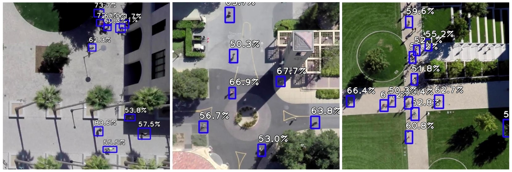
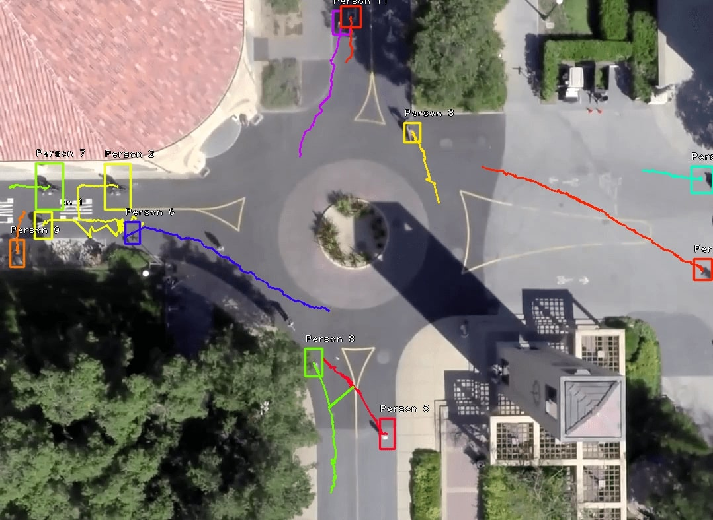
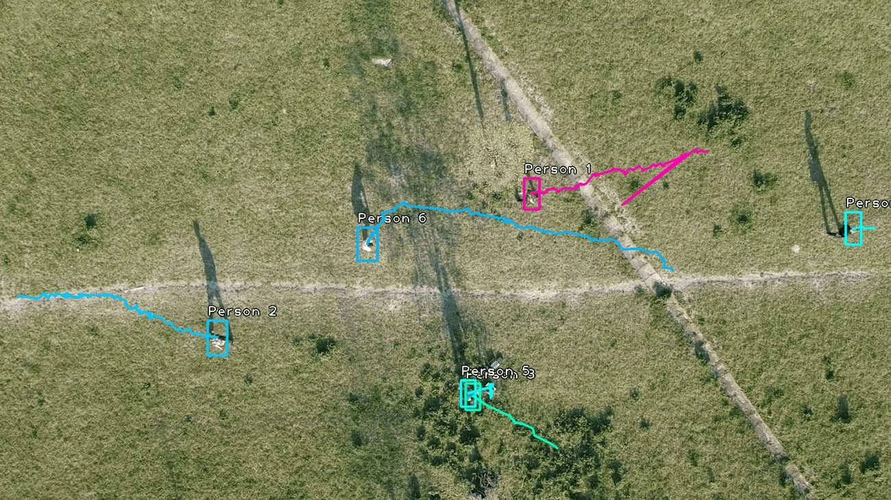
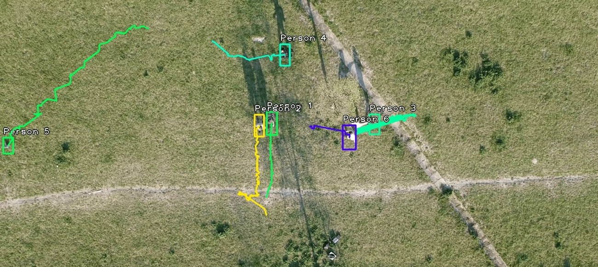

<!----------------------------------------------------------------------------->

# People Detector

- Brno University of Technology
- Faculty of Information Technology
- Academic year: 2018/2019
- Bachelor thesis: Monitoring Pedestrian by Drone
- Author: Vladimir Dusek

<!----------------------------------------------------------------------------->

## Thesis abstract

This thesis is focused on monitoring people in video footage captured by a drone. People are detected by a trained model of the RetinaNet detector. A feature vector is extracted for each detected person using color histograms. The identification of people is realized by comparing their feature vectors concerning their distance in the frame. In the end, the trajectories of all people are visualized in a panorama image. The accuracy of the trained RetinaNet detector on hard validation data is 58.6 %. The error rate is partially reduced by way of algorithm design for trajectory visualization. It is not necessary to successfully detect a person on every frame for correct visualization of its trajectories. At the same time, static objects which are detected as a person but are not moving are not considered as people and are not visualized at all. There is a lot of algorithms dealing with people detection, yet only a few of them are focused on detection people from aerial footage.

<!----------------------------------------------------------------------------->

## Reference

> [**Assignment**](assignment/assignment.pdf) 
> — Description of the assignment in Czech.

> [**Text**](text/text.pdf) 
> — The text of the thesis in Czech.

> [**Application**](app/) 
> — Application People Detector.

> [**Examples**](examples/) 
> — Video and images for the experiments with the application.

<!----------------------------------------------------------------------------->

## Application

### GUI

### Examples

#### Detector

 

#### Detector + identification

<!-- Obsah:
- app/ -- demonstrační aplikace People Detector
- app/models/ -- natrénované modely na datasetu Stanford Drone Dataset
- app/src/ -- zdrojové kódy aplikace
- app/requirements.txt -- seznam potřebných knihoven pro zprovoznění aplikace
- app/LICENSE -- licence
- examples/ -- testovací obrázky a videa pro People Detector
- tex/ -- adresář se zdrojovými texty technické zprávy v~jazyce \LaTeX
- readme.txt -- manuál pro spuštění aplikace a další informace
- text.pdf -- technická zpráva
- text-print.pdf -- technická zpráva pro tisk (odkazy jsou černé)

Stanford Drone Dataset:
- http://cvgl.stanford.edu/projects/uav_data/

Instalace zavislosti pro aplikaci People Detector:
- Python 3.6+
- Pip
- PyQt4
    # dnf install python3-PyQt4
    # apt install python3-pyqt4
- Python libraries
    $ pip3 install -r app/requirements.txt

Spusteni aplikace:
$ cd app/src/
$ python3 main.py -->
