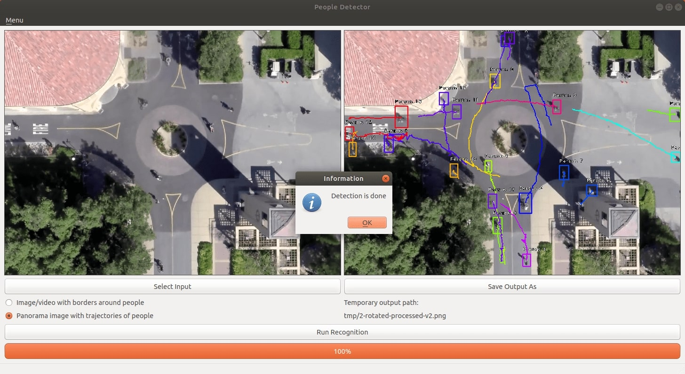
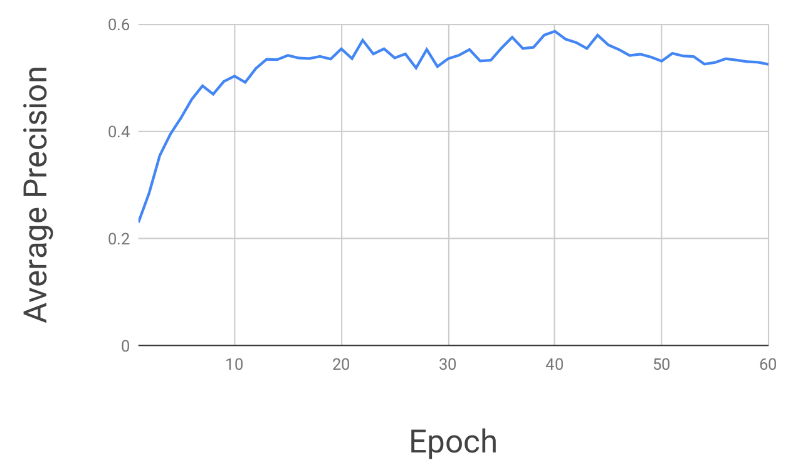
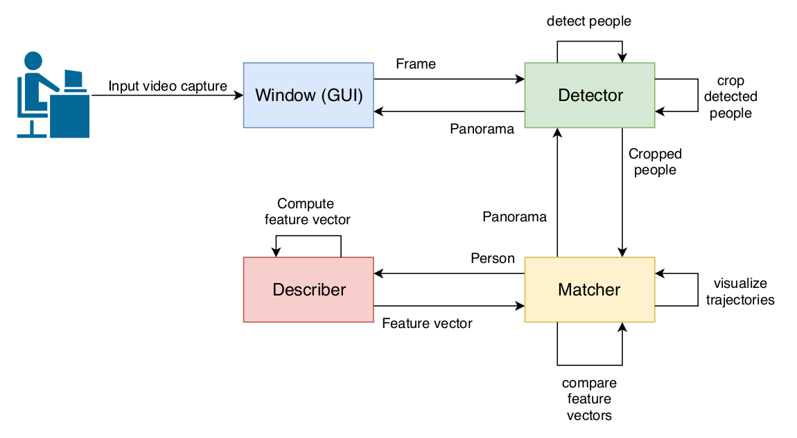
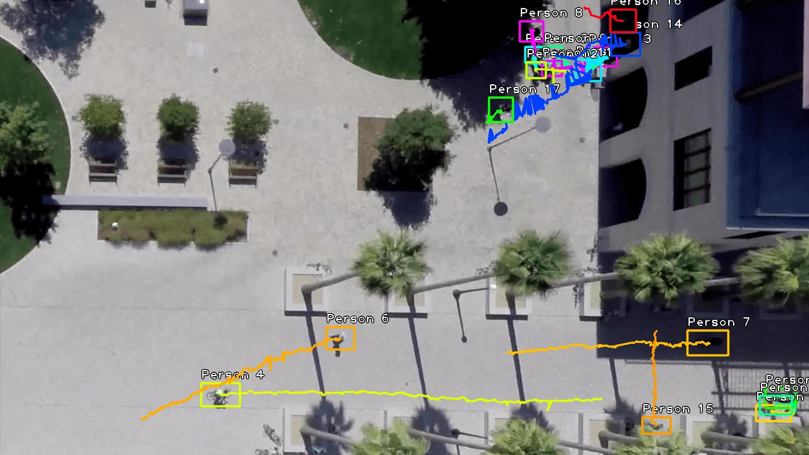
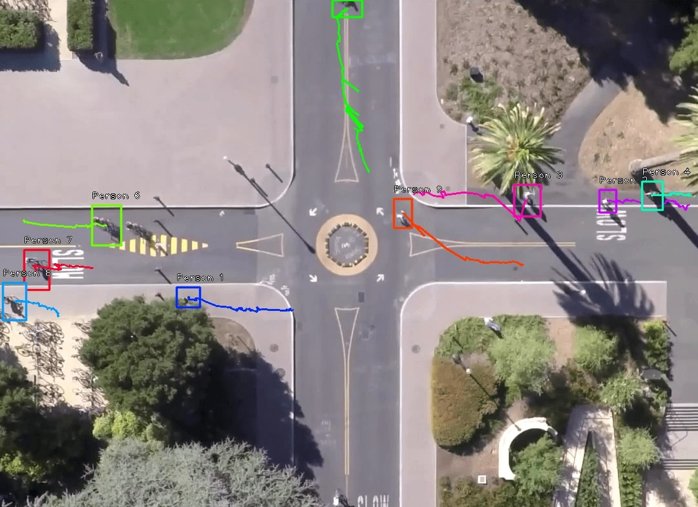

<!----------------------------------------------------------------------------->

# People Detector

- Brno University of Technology
- Faculty of Information Technology
- Academic year: 2018/2019
- Bachelor thesis: Monitoring Pedestrian by Drone
- Author: Vladimir Dusek

<!----------------------------------------------------------------------------->
<!----------------------------------------------------------------------------->
<!----------------------------------------------------------------------------->

## Thesis abstract

This thesis is focused on monitoring people in video footage captured by a drone. People are detected by a trained model of the RetinaNet detector. A feature vector is extracted for each detected person using color histograms. The identification of people is realized by comparing their feature vectors concerning their distance in the frame. In the end, the trajectories of all people are visualized in a panorama image. The accuracy of the trained RetinaNet detector on hard validation data is 58.6%. The error rate is partially reduced by way of algorithm design for trajectory visualization. It is not necessary to successfully detect a person on every frame for correct visualization of its trajectories. At the same time, static objects which are detected as a person but are not moving are not considered as people and are not visualized at all. There is a lot of algorithms dealing with people detection, yet only a few of them are focused on detection people from aerial footage.

<!----------------------------------------------------------------------------->
<!----------------------------------------------------------------------------->
<!----------------------------------------------------------------------------->

## Reference

> [**Assignment**](assignment/assignment.pdf)<br>
> — Description of the thesis assignment in Czech.

> [**Text**](text/text.pdf)<br>
> — The text of the thesis in Czech.

> [**Presentation**](defense/presentation.pdf)<br>
> — The thesis defense presentation in Czech.

> [**Application**](app/)<br>
> — Application People Detector.

> [**Examples**](examples/)<br>
> — Video and images for the experiments with the application.

<!----------------------------------------------------------------------------->
<!----------------------------------------------------------------------------->
<!----------------------------------------------------------------------------->

## Application

- As a detector was used [Fizyr Keras Retinanet](https://github.com/fizyr/keras-retinanet).
- New model was trained on [Stanford Drone Dataset](http://cvgl.stanford.edu/projects/uav_data/).
- GUI was implemented in [PyQt4](https://www.riverbankcomputing.com/software/pyqt).
- Process one image using CPU can last about 5 seconds so if you're planning process video I definitely recommend using GPU computing. See [Tensorflow GPU](https://www.tensorflow.org/install/gpu).

<!----------------------------------------------------------------------------->

### GUI



You can manage the application using the GUI. Just select the input image/video, specify output type and run recognition. 

<!----------------------------------------------------------------------------->

### How to run it

1. Clone this repository.
2. Download my pretrained models from [Google Drive](https://drive.google.com/open?id=1Tk2dt1mn3nVipbIb-txI9e-NFkr1VYjJ). You can use your own model as well.
3. Specify path to the model [on this](https://github.com/vdusek/people_detector/blob/master/app/src/detector.py#L25) line.
    - Optionally you can change the following parameters: [DETECTION_TRESHOLD](https://github.com/vdusek/people_detector/blob/master/app/src/detector.py#L28), [EUCLIDEAN_DISTANCE_TRESHOLD(https://github.com/vdusek/people_detector/blob/master/app/src/matcher.py#L20), [HIST_SIMILARITY_TRESHOLD](https://github.com/vdusek/people_detector/blob/master/app/src/matcher.py#L23), [FIRST_AND_LAST_POINT_TRESHOLD](https://github.com/vdusek/people_detector/blob/master/app/src/matcher.py#L26) and [P](https://github.com/vdusek/people_detector/blob/master/app/src/utils.py#L17).
4. You should have Python3.7+ and its package manager Pip.
5. Install all Python requirements by following command.
    ```
    $ pip install --user -r app/requirements.txt
    ```
6. Since PyQt isn't just Python package it has to be installed by your system package manager.
    ```
    # RPM
    $ sudo dnf install python3-PyQt4
    ``` 
    ```
    # Debian
    $ sudo apt install python3-pyqt4
    ```
7. Run the People Detector.
    ```
    $ cd app/src/
    $ python main.py
    ```

<!----------------------------------------------------------------------------->

### Precision of the detector



Average precision on validation data according to trained epochs. The best value 58.6% was measured after 40 epoch. Precision is pretty low because some data are really hard. You can check it, some people are difficult to recognize even for men. Moreover, some annotations are not 100% correct. You can experiment with the models. Model after 40 epoch definitely doesn't have to be the best for every capture.

<!----------------------------------------------------------------------------->

### Schema of the whole application



<!----------------------------------------------------------------------------->

### Some examples

#### Detection of people in the images.


 

#### Detection and identification of people in the short videos.







<!----------------------------------------------------------------------------->
<!----------------------------------------------------------------------------->
<!----------------------------------------------------------------------------->

## Resources

<!----------------------------------------------------------------------------->

### Technology

- [Python](https://www.python.org/)
- [Fizyr Keras Retinanet](https://github.com/fizyr/keras-retinanet)
- [PyQt4](https://www.riverbankcomputing.com/software/pyqt)
- [Pillow](https://pillow.readthedocs.io/en/stable/)
- [Keras](https://keras.io/)
- [Tensorflow](https://www.tensorflow.org/)
- [OpenCV](https://opencv.org/)
- [SciPy](https://www.scipy.org/)
- [NumPy](https://www.numpy.org/)

<!----------------------------------------------------------------------------->

### Dataset
- [Stanford Drone Dataset](http://cvgl.stanford.edu/projects/uav_data/)

<!----------------------------------------------------------------------------->

### Articles
- [The intuition behind RetinaNet](https://medium.com/@14prakash/the-intuition-behind-retinanet-eb636755607d)
- [A Guide to Utilizing Color Histograms for Computer Vision and Image Search Engines](https://www.pyimagesearch.com/2014/01/22/clever-girl-a-guide-to-utilizing-color-histograms-for-computer-vision-and-image-search-engines/)
- [How to install TensorFlow with GPU support](https://medium.com/@cjanze/how-to-install-tensorflow-with-gpu-support-on-ubuntu-18-04-lts-with-cuda-10-nvidia-gpu-312a693744b5)

<!----------------------------------------------------------------------------->

### Papers
- [Focal Loss for Dense Object Detection](https://arxiv.org/pdf/1708.02002.pdf)
  - Retinanet's loss function.
- [Feature Pyramid Networks for Object Detection](https://arxiv.org/pdf/1612.03144.pdf)
  - Retinanet uses structure Feature Pyramid Network.
- [Deep Residual Learning for Image Recognition](https://arxiv.org/pdf/1512.03385.pdf)
  - Retinanet uses Residual Neural Network.

<!----------------------------------------------------------------------------->

Many other resources I used during working on this project can be found in the 'Literatura' section of the [text](text/text.pdf).

<!----------------------------------------------------------------------------->
<!----------------------------------------------------------------------------->
<!----------------------------------------------------------------------------->